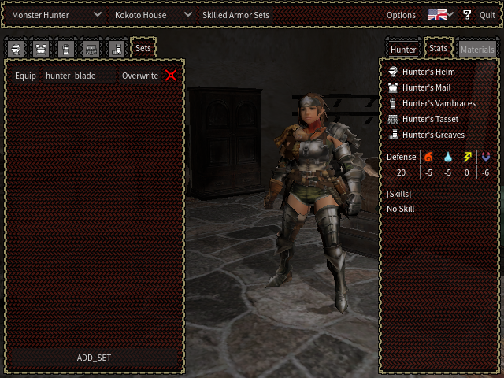

# Monster Hunter Wardrobe

This is a native desktop app in which you can preview every armor piece available in Monster Hunter 1 (NTSC-J) and Monster Hunter G. You can also change the player model, and pick from any of the five guest house rooms or the Kokoto player house as a backdrop. This project is version 2 of the app that is currently available for download through my [Monster Hunter 1/G/2 wiki.](https://wiki.mholdschool.com/) I didn't use version tracking for version 1 of the app, and never published the source code, hence I'm starting this app from scratch at version 2.

## OS Support

In keeping with version 1 of the app, I will attempt to provide working executables (found in the releases section) for the following five platforms and Linux arm64 (note that Vulkan renderer is required in addition to other requirements):

- Linux arm64 (untested)
- Linux 32-bit (untested)
- Linux 64-bit (Mint 21.3 Cinnamon tested)
- macOS (untested)
- Windows 32-bit (untested)
- Windows 64-bit (10 tested)

The macOS build should theoretically work on 10.12 Sierra or newer, however I haven't been able to test this.

No installation required: just download the compressed folder for your system from the Releases page and extract the contents to the folder of your choice. Be sure to keep all contents in the same place in order for the application to work properly. Your platform may require additional steps for the app to run: see the sections below.

I have designed this app for a desktop computer environment, with a keyboard and mouse; I have plans to implement more control elements and inputs to allow everything to work with only the keyboard or mouse. I'm also planning to implement gamepad support.

Feel free to use Godot to build this app in your environment for yourself, but I cannot promise it will work properly for any platform except those listed above.

### Linux

In order to run the app, you need to allow the executable to run as a program. Open the Properties menu for the MHAW file (`MHAW.x86_32`, `MHAW.x86_64`, or `MHAW.arm64` depending on your platform), visit the Permissions tab, and check "Allow executing file as program". I have only tested the x86_64-bit build on Linux Mint 21.3 Cinnamon, but I believe the releases should work just fine in most distros with the help of the bundled libraries.

### MacOS

Extract to your Applications directory to avoid file path issues. Gatekeeper will block execution of this app, since it isn't notarized and signed, warning you that "Apple cannot check it for malicious software." At this time, I am not part of the Apple Developer Program, so I cannot code sign the app for MacOS users. Godot maintains directions for macOS users to run unsigned apps in its documentation [here](https://docs.godotengine.org/en/stable/tutorials/export/running_on_macos.html#doc-running-on-macos), but I'll summarize.

There are two ways to open the app:

- 1. Try to open the app normally, and the warning popup will appear. Open System Preferences and go to Security & Privacy. In the General tab, "Monster Hunter Armor Wardrobe" will be listed in the "Allow apps" section: click "Open Anyway" to open the app.
- 2. Right click, or Control + click, the app and select Open from the dropdown. The same warning popup will appear, but an "Open" button will be available.

Theoretically, the app should run on macOS 10.12 Sierra or newer. In my brief testing, the OpenGL3 fallback did not work properly in 10.13 High Sierra.

### Windows

Windows Defender will interrupt execution of this app, but you can click "Run anyway" to open it. A signed certificate would be expensive to maintain, so I am not expecting to code sign the app for Windows any time soon. I have only tested the Windows 64-bit build in Windows 10, though it should work just fine in Windows 11 as well. Theoretically, Windows 7 and 8 should be able to run the app, using OpenGL3 as a fallback if Vulkan drivers aren't available.

## Interface

The menu panel on the left includes the list of all armor pieces, with a radio button to select each piece to equip. The right menu displays the player's stats and skills based on the current equipment, and provides a panel to edit the player's features (gender, face, hair, etc.) Several armor pieces are gendered, so I've opted to keep armor selections isolated between the female and male player models as if there are always two player slots available in the app: one female, one male. You can save and load armor sets regardless of your player customization, but invalid armor pieces will display a message and not be equipped by default: E.G. loading a set with Maiden armor pieces on a male player.

The toolbar at the top contains dropdowns to change the game, change the room, equip a skilled armor set for Monster Hunter 1, change various options for the app, and quit.

### Options

In the Audio menu, change or mute the master volume, and the same for sound effects and music separately.

In the Video menu, choose between two Display Style options:
- "PS2" will render at roughly the same resolution as the original game (640 x 480), and scale to the window size.
- "Auto" will render at the same size as the window.

## Save Data

Save data is split into two files: `settings.cfg` which contains the window size, and `save.cfg` which contains all other data, including character customization, armor sets, and audio settings. Your save data location depends on the platform you're using, and can be found in the following directories:

- Linux: `~/.local/share/mh_armor_wardrobe`
- macOS: `~/Library/Application Support/mh_armor_wardrobe`
- Windows: `%APPDATA%\mh_armor_wardrobe`

## Tools and Resources

### Godot Engine

I've used [Godot](https://godotengine.org/) 4 to build this project, while the previous iteration of the app used Godot 3. This required some extensive code re-writing, due to changes in the engine and GDScript, but has been painless so far. I considered using some C# or even C++ for this project, but I haven't yet found any instances where this would provide a significant improvement in performance: most of the scripting operations here are built-in engine commands, or fairly lightweight operations whose minor improvements will be offset by the greater amount of debugging time incurred by C# restrictions and lacking documentation on Godot's part.

### Game Resources

All models and audio files were extracted, and converted where needed, from game files using the following tools:

- [AFSExplorer 3.7](http://dte-ng.issextreme.net): Used to unpack .afs files (and maybe some other things?) Can also be found [here.](https://www.moddingway.com/file/270.html)
- [PSound 2.01](http://snailrush.online.fr/): Used to unpack and convert .snd and .snp audio files. Can also be found [here.](https://www.romhacking.net/utilities/679/)
- [MHMultiTool](https://github.com/MH-Oldschool/MHMultitool): Used to extract images, such as textures and icons, and convert them to .png format.
- [2Tie's Addons](https://drive.google.com/file/d/15rCCcZWy1YBcEY0g1eX3WK3vLuqUYgh3/view?usp=sharing): Used to import .amo model files and animations into Blender. This is a modified plugin created by [2Tie](https://github.com/2Tie), based on the [Monster Hunter Frontier Importer](https://github.com/AsteriskAmpersand/Monster-Hunter-Frontier-Importer). 2Ties modifications account for the PlayStation 2 games using the .amo format, which includes geometry and bone data in the same file, while Frontier split geometry and bones into two separate files.

[Darto](https://github.com/The1andonlyDarto) has provided [this wiki page](https://github.com/The1andonlyDarto/MHAssetInfo/wiki/2Tie's-Old-Gen-MH-Model-Importing) to assist in handling Monster Hunter assets specifically, which contains further directions and links to some of the above tools.

### Models

I exported all models in `.glb` format, with .png images as textures. Models have been scaled down to 1% of their original size; it seems that the in-game world scale was much different than modern standards, likely in keeping with the PlayStation 2's unusual floating-point numbers.

### Armor Models

Monster Hunter armor models and player models are grouped together into six categories: hair, body, arms, waist, legs, and face. Each model includes its own bones, and although most model categories include only the bones they need for their geometry, legs models include the full skeleton (barring a extra hair bones that belong to a few hair models). The Hair category includes all headgear models as well as player hair options. The body, arms, and legs categories include the base player models (E.G. no armor equipped), which do not appear to have differing geometry, but do have different skin textures: one for each of the four possible skin tones. The player's chosen face model determines their skin tone.

In order to reduce file size and ensure synchronized poses between body parts, I decided to use one single armature for each gender of hunter, and map all the models onto it. After much trial and error, I succeeded in combining everyting into two models in this project: one female hunter and one male. Each model contains all the body part and armor piece models for its gender.

I had a hard time applying player animations from the game, and so both the male and female model share the male idle animation, with adjustments done by hand to correct some abbherations. I think this is due to the animation tables not lining up with the way I configured the armatures, but I don't know enough about the animation tables to be sure. I may consider going through all this again to add the female idle in the future.

### Rooms and Lighting

Room models don't contain any lighting information, to my knowledge. I've attempted to recreate the lighting conditions used in-game based on video and screenshot reference, but it will always be an approximation. I would like to better emulate the in-game lighting at some point in the future.

### Audio

The `.snd` and `.snp` audio files don't appear to contain a sample rate definition (or PSound doesn't know how to parse it), and there isn't a common sample rate used across all audio files. I've had to use my memory and best guesses to determine which sample rates to use when converting these files, but I believe they're accurate enough if not perfect.

### Language and Fonts

This app is localized into three languages: English, Japanese, and Mandarin Chinese. The Japanese language version is largely based on content from [mmPotato's Monster Hunter G wiki](http://infoseek_rip.g.ribbon.to/mmpotato.hp.infoseek.co.jp/codes/MHG/), with some assistance by members of the [Monster Hunter Old School community.](https://mholdschool.com/) The Mandarin Chinese translation was provided wholly by PoogieCharger(猪突猛进锅).

I've used two fonts courtesy of Google Fonts in this project: Noto Sans, and Yantramanav. I used Noto Sans for the English language mode, while I opted to use Yantramanav for Japanese and Chinese. I believe Noto Sans looks fairly close to the typeface used in the original PlayStation 2 Monster Hunter games, but it does not render Japanese or Chinese characters properly, hence the need for a second font.

## Feature Checklist
- [ ] Armor
	- [x] Shared skeletons/armatures: one male, one female
	- [x] Separate armor categories into different tabs
	- [x] Apply current hair color when equipping armor with hair
	- [x] Apply current skin texture when equipping armor with exposed skin
	- [x] Menu to equip MH1 armor sets that have armor skills
	- [x] Import and Export comma-separated armor code to integrate with the wiki's set builder
	- [ ] Include armor skill points in the armor piece list for MHG
	- [ ] Search bar for armor pieces by name
	- [ ] Filter by element resistance
	- [ ] Filter by armor skill
	- [ ] Filter by rank availability
- [x] Player
	- [x] Toggle gender
	- [x] Change face (also changes skin tone)
	- [x] Change hair model
	- [x] Change hair color
- [ ] Rooms
	- [x] Room models
	- [x] Fade through black when changing rooms
	- [x] Add room music
	- [ ] Match room lighting to the games (currently a rough approximation)
- [x] Equipment sets
	- [x] Let users save multiple custom equipment sets (upper limit?)
- [x] Gamepad controls
- [x] User options:
	- [x] "Original" vs high-definition rendering
- [x] Save data
	- [x] Save hunter settings
	- [x] Save armor sets
